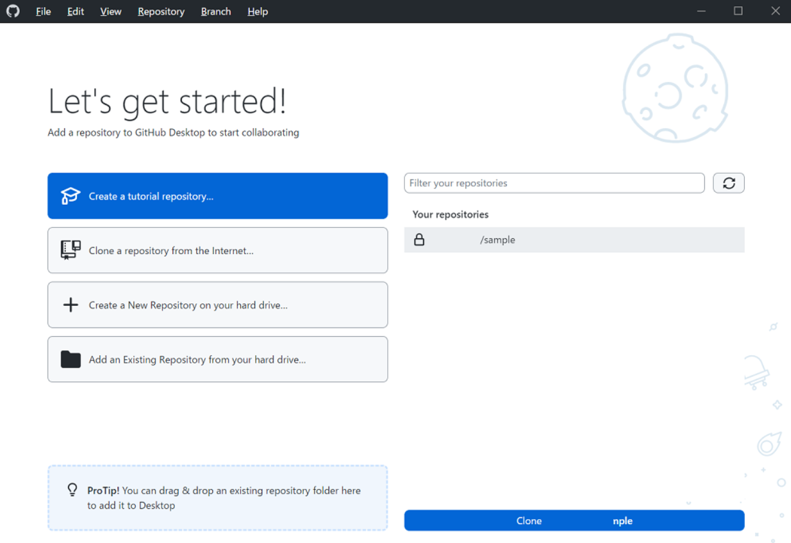

# 演習の進め方について。

この講習では、Python を使用して xArm を実際に操作していただきます。ただし、xArm を実際に動かすためには、実機をパソコンに接続し、いくつかの設定を行う必要があります。各台を個別に接続して設定すると時間がかかるため、今回は一つのパソコンでコードを実行する形で進めます。

そこで、今回は一つのパソコンから全員分のコードを効率よく実行するために、Githubを使ってコードを共有してもらおうと思っております。

このページでは、軽く Git について解説していきたいと思います。ですが今回のメインは xArm についてですので、Git の基礎的なところを詳しく説明するというよりは、今回の演習で必要なところだけを説明するという形になるのでご了承ください。

# 今回の Git でやってほしいこと

まず、GitHub のリポジトリには 1 つの main ブランチが作成されており、その中に今回使用するコードのテンプレートなどのファイルが格納されています。皆さんには、ワークショップ中にこのファイルを編集し、GitHub で共有することで、私の PC からでもコードを実行できるようにしていただきます。ですので、ワークショップが始まる前に、以下の三つの手順で自分のブランチを作成し、GitHub に更新して事前準備をしておいていただきたいです。

### <u>事前準備</u>

### 1. Github からレポジトリーをクローン。

### 2. main ブランチから、自分の名前でブランチを新しく作成。

### 3. 作ったブランチを Github にパブリッシュ。

 

 

# Github Desktop を使ったやり方

Git の管理には、コマンドラインで操作するGit BashやVS Codeの拡張機能などさまざまな方法がありますし、それぞれ非常に便利です。本当に人によって好みが分かれるところです。もし、心に決めているツールがあるのであれば、ぜひそちらを使っていただいて構いません。もしそのようなものがなければ、せっかくの機会ですので今回紹介するGithub Desktopも試してみてください。

まずは[公式 Github Desktop ダウンロード](https://desktop.github.com/)してください。

インストール後開くと、サインインしてくれとの指示があるので、それに従いサインインします。
サインインプロセスが終了すると、以下のような画面になると思いますので、Clone a respository from the internet....をクリックしてください。

