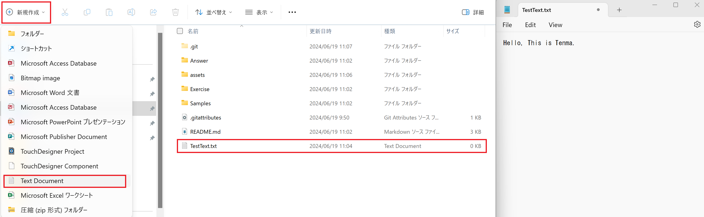

# 演習の進め方について。

この講習では、Python を使用して xArm を実際に操作していただきます。ただし、xArm を実際に動かすためには、実機をパソコンに接続し、いくつかの設定を行う必要があります。各台を個別に接続して設定すると時間がかかるため、今回は一つのパソコンでコードを実行する形で進めます。

そこで、今回は一つのパソコンから全員分のコードを効率よく実行するために、Git を使ってコードを共有してもらおうと思っております。

このページでは、軽く Git の使い方について解説していきたいと思います。今回のメインは xArm についてですので、Git の基礎的なところを詳しく説明するというよりは、今回の演習で必要なところだけを説明するということになるのでご了承ください。

# コラボレーターの設定。

このレポジトリーの操作をしていただくには、コラボレーターになっていただく必要があります。そのために、以下の流れに従ってください。

1. Github アカウントを内山天満に共有。共有方法はなんでも大丈夫です。
2. その後、コラボレーターの招待が送られると思うので、それを承認。

# ワークショップ前にやっておいてほしい Git 環境の構築。

まず、GitHub のリポジトリには 1 つの main ブランチが作成されており、その中にワークショップで使用するコードのテンプレートなどのファイルが格納されています。皆さんには、このファイルを編集し、GitHub で共有することで、私の PC からでもコードを実行できるようにしていただきます。そこで、ワークショップが始まる前に、以下の三つの手順で自分のブランチを作成し、GitHub に更新して事前準備をしておいてください。

### <u>事前準備</u>

### 1. Github からレポジトリーをローカルにクローン。

### 2. main ブランチから、自分の名前でブランチを新しく作成。

### 3. 作ったブランチを Github にパブリッシュ。

 

 

# Github Desktop を使ったやり方。

Git の管理には、コマンドラインを使った GitBash や VS Code の拡張機能などさまざまな方法がありますし、それぞれ非常に便利です。本当に人によって好みが分かれるところです。もし、すでに心に決めたツールがあれば、ぜひそちらを使っていただいて構いません。しかし、今回紹介する GitHub Desktop も非常に便利ですので、せかっくの機会なので試してみてください。

まずは[公式 Github Desktop ダウンロード](https://desktop.github.com/)してください。

インストール後開くと、サインインしてくれとの指示があるので、それに従いサインインします。
Github Desktop に戻る前に、クローンしたいレポジトリの URL をコピーしておきます。このレポジトリの一番上のページに戻り、緑色の Code ボタンをクリック。表示された HTTP リンクをコピーしてください。
 

 

サインインプロセスを終了し Github Desktop を開くと、以下のような画面にが開くと思いますので、Clone a respository from the internet....をクリックしてください。

 

 

するとクローンするレポジトリを指定する画面が表示されます。URL タブを開き、上の空欄に先ほどコピーしたレポジトリの URL、下の欄にレポジトリを保存したいフォルダを指定してください。どちらとも空欄を埋めたら、Clone ボタンをクリックします。

 

 

クローンすると、レポジトリを管理する画面が表示されます。表示されたら画面の上のほうに、Current branch main と書かれたタブが確認できると思います。それをクリックすると、レポジトリ内のブランチの一覧が表示されます。その中にある NewBranch をクリックして新しいブランチを作成します。

 

 

すると新しいブランチ名を記入するウィンドウが表示されるので、そこに自分の名前を入れて Create Branch ボタンをクリックしてください。

 

 

すると先ほどの Current Branch main が指定した名前のブランチになっていると思います。そしたらその横にある Publish ブランチボタンをクリックしてください。

 

 

以上で事前準備は完了になります。

これで、Github に自分の作成したブランチが更新されているはずです。ブラウザの Github に戻って確認してみましょう。レポジトリページのブランチのプルダウンボタンをクリックしてください。すると、先ほど作成した自分のブランチが更新されているはずです。

 

 

# ローカルの変更を Github に反映させる

自分のブランチ内で編集した内容を、Github に反映させる方法を紹介します。
まずは、自分のブランチを選択後、レポジトリ内で適当なテキストファイルを作成します。

 

 

作成した後、Github Desktop の画面を確認すると、画面左側に変更があったファイルの一覧が表示されます。左下には変更内容を保存するコミットボタンが配置されています。
コメントを記述して、コミットボタンを押します。

 

 

コミットボタンを押したら、選択したファイルが左側の画面から消え、右上のほうに Push Origin が表示されます。
これをクリックすると Github に変更が反映されます。

 

 

Github にて確認してみます。レポジトリを開いて、自分のブランチを選択すると、先ほどローカルで作成したファイルが、Github に反映されているのが確認できます。

 

 
